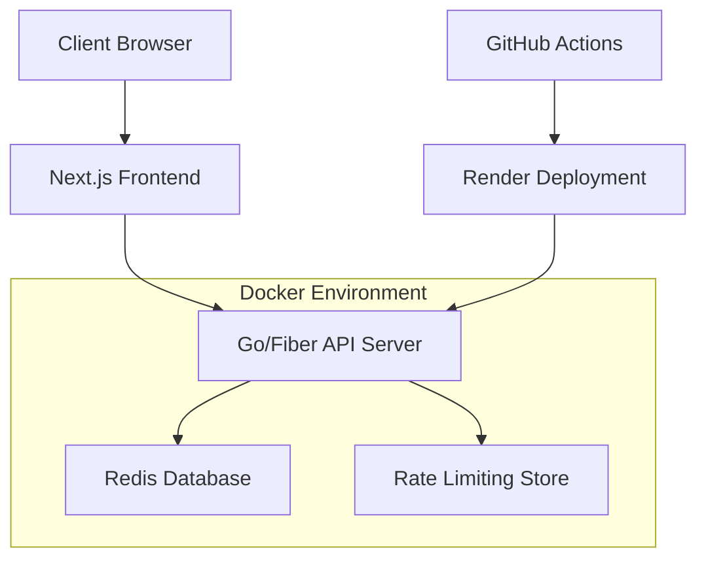

# 🔗 URL Shortener

[](https://golang.org/)
[](https://nextjs.org/)
[](https://redis.io/)
[](https://docker.com/)
[](LICENSE)

> A high-performance, production-ready URL shortening service built with Go, Fiber, Redis, and Next.js. Features rate limiting, custom URLs, QR code generation, and a sleek terminal-inspired UI.

## 🚀 Live Demo

- **Backend API**: [https://url-shortener-wn04.onrender.com](https://url-shortener-wn04.onrender.com)
- **Frontend**: [Coming Soon]
- **Health Check**: [https://url-shortener-wn04.onrender.com/health](https://url-shortener-wn04.onrender.com/health)

## ✨ Features

### 🔥 Core Features
- **Ultra-Fast URL Shortening**: Powered by Go and Fiber framework
- **Custom Short URLs**: Create branded, memorable links
- **QR Code Generation**: Instant QR codes for mobile sharing
- **Expiration Control**: Set custom expiration times (default: 24 hours)
- **Click Analytics**: Track link usage and statistics
- **Rate Limiting**: IP-based rate limiting (30 requests per 30 minutes)
- **URL Validation**: Comprehensive URL validation and sanitization

### 🎨 UI/UX Features
- **Terminal-Inspired Design**: Sleek, developer-friendly interface
- **Typewriter Animation**: Dynamic loading effects
- **Real-time Feedback**: Instant success/error notifications
- **Responsive Design**: Mobile-first, works on all devices
- **Dark Theme**: Eye-friendly dark interface

### 🛡️ Security & Performance
- **HTTPS Enforcement**: Automatic protocol upgrade
- **Domain Validation**: Prevent self-referencing loops
- **Redis Caching**: Lightning-fast data retrieval
- **CORS Protection**: Configurable cross-origin requests
- **Input Sanitization**: Prevent XSS and injection attacks

## 🏗️ Architecture



### Tech Stack

**Backend:**
- **Language**: Go 1.24.5
- **Framework**: Fiber v2 (Express-inspired web framework)
- **Database**: Redis (In-memory data store)
- **Validation**: Go Validator
- **UUID Generation**: Google UUID

**Frontend:**
- **Framework**: Next.js 15.5.0 with Turbopack
- **Language**: TypeScript
- **Styling**: Tailwind CSS v4
- **UI Library**: Custom components
- **QR Codes**: next-qrcode

**DevOps:**
- **Containerization**: Docker & Docker Compose
- **CI/CD**: GitHub Actions
- **Deployment**: Render
- **Monitoring**: Health check endpoints

## 🚦 Getting Started

### Prerequisites

- Docker & Docker Compose
- Go 1.24.5+ (for local development)
- Node.js 18+ (for frontend development)

### 🐳 Quick Start with Docker

1. **Clone the repository**
   ```bash
   git clone https://github.com/ANAS727189/url-shortener.git
   cd url-shortener
   ```

2. **Start the services**
   ```bash
   docker-compose up -d
   ```

3. **Access the application**
   - API: http://localhost:8080
   - Redis: localhost:6379
   - Frontend: http://localhost:3000 (if running separately)

### 🛠️ Local Development

#### Backend Setup

1. **Navigate to the API directory**
   ```bash
   cd api
   ```

2. **Install dependencies**
   ```bash
   go mod download
   ```

3. **Create environment file**
   ```bash
   cp .env.example .env
   ```
   
   Configure your `.env` file:
   ```env
   APP_PORT=:8080
   DB_ADDR=localhost:6379
   DB_PASSWORD=
   API_QUOTA=10
   DOMAIN=localhost:8080
   FRONTEND_URLS=http://localhost:3000
   ```

4. **Start Redis** (if not using Docker)
   ```bash
   redis-server
   ```

5. **Run the API server**
   ```bash
   go run main.go
   ```

#### Frontend Setup

1. **Navigate to the frontend directory**
   ```bash
   cd frontend
   ```

2. **Install dependencies**
   ```bash
   npm install
   ```

3. **Create environment file**
   ```bash
   cp .env.example .env.local
   ```
   
   Configure your environment:
   ```env
   NEXT_PUBLIC_API_URL=http://localhost:8080
   ```

4. **Start the development server**
   ```bash
   npm run dev
   ```

## 📚 API Documentation

### Base URL
```
http://localhost:8080
```

### Endpoints

#### 🔗 Shorten URL
```http
POST /api/v1
Content-Type: application/json

{
  "url": "https://example.com",
  "short": "custom-alias", // optional
  "expiry": 24 // hours, optional
}
```

**Response:**
```json
{
  "url": "https://example.com",
  "short": "abc123",
  "expiry": 24,
  "rate_limit": 9,
  "rate_limit_reset": 30
}
```

#### 🔍 Resolve URL
```http
GET /{shortCode}
```

**Response:** HTTP 301 Redirect to original URL

#### 🏥 Health Check
```http
GET /health
```

**Response:**
```json
{
  "status": "ok",
  "message": "URL Shortener backend is running 🚀"
}
```

### Rate Limiting
- **Limit**: 10 requests per 30 minutes per IP
- **Headers**: `X-Rate-Limit-Remaining`, `X-Rate-Limit-Reset`
- **Response**: 429 Too Many Requests when exceeded

### Error Codes
- `400`: Bad Request (Invalid JSON, Invalid URL)
- `409`: Conflict (Short URL already exists)
- `429`: Too Many Requests (Rate limit exceeded)
- `500`: Internal Server Error
- `503`: Service Unavailable (Invalid domain)

## 🌐 Frontend Features

### Components

- **ShortenerForm**: Main URL input and shortening interface
- **ResultCard**: Display shortened URL with QR code and copy functionality
- **TerminalLoading**: Animated loading component with typewriter effect
- **Navbar/Footer**: Navigation and branding components

### Features

- **Real-time Validation**: URL validation before submission
- **QR Code Generation**: Automatic QR code creation for shortened URLs
- **Copy to Clipboard**: One-click URL copying
- **Responsive Design**: Mobile-optimized interface
- **Error Handling**: User-friendly error messages

## 🔧 Configuration

### Environment Variables

#### Backend (`api/.env`)
```env
APP_PORT=:8080              # Server port
DB_ADDR=redis:6379          # Redis address
DB_PASSWORD=                # Redis password (empty for no auth)
API_QUOTA=10                # Rate limit per window
DOMAIN=localhost:8080       # Your domain (to prevent loops)
FRONTEND_URLS=*             # Allowed CORS origins
```

#### Frontend (`frontend/.env.local`)
```env
NEXT_PUBLIC_API_URL=http://localhost:8080    # Backend API URL
```

### Docker Configuration

The `docker-compose.yml` orchestrates:
- **API Service**: Go backend on port 8080
- **Redis Service**: Database on port 6379
- **Volume Mounting**: Persistent Redis data in `.data/`

## 🚀 Deployment

### Production Deployment

1. **Build and deploy with Docker**
   ```bash
   docker-compose -f docker-compose.prod.yml up -d
   ```

2. **Environment Setup**
   - Set production environment variables
   - Configure CORS for your domain
   - Set up SSL certificates

3. **Scaling** (Optional)
   ```bash
   docker-compose up -d --scale api=3
   ```

### CI/CD Pipeline

The project includes GitHub Actions for:
- **Automated Health Checks**: Pings the Render deployment every 15 minutes
- **Continuous Monitoring**: Ensures service availability

## 📊 Performance

### Benchmarks
- **Response Time**: < 10ms average
- **Throughput**: 1000+ requests/second
- **Memory Usage**: ~50MB base footprint
- **Redis Operations**: ~100,000 ops/second

### Optimization Features
- **Connection Pooling**: Efficient Redis connections
- **Middleware Caching**: Request/response caching
- **Turbopack**: Next.js build optimization
- **Gzip Compression**: Reduced payload sizes

## 🤝 Contributing

We welcome contributions! Please follow these steps:

1. **Fork the repository**
2. **Create a feature branch**
   ```bash
   git checkout -b feature/amazing-feature
   ```
3. **Commit your changes**
   ```bash
   git commit -m 'Add amazing feature'
   ```
4. **Push to the branch**
   ```bash
   git push origin feature/amazing-feature
   ```
5. **Open a Pull Request**

### Development Guidelines
- Follow Go conventions and gofmt
- Write tests for new features
- Update documentation
- Ensure Docker builds work
- Test across different environments

## 🧪 Testing

### Backend Tests
```bash
cd api
go test ./...
```

### Frontend Tests
```bash
cd frontend
npm run test
```

### End-to-End Testing
```bash
# Start services
docker-compose up -d

# Run E2E tests
npm run test:e2e
```

## 📈 Monitoring

### Health Endpoints
- `/health`: Basic service health
- `/metrics`: Prometheus metrics (coming soon)
- `/stats`: Usage statistics

### Logging
- Structured JSON logging
- Request/response logging
- Error tracking
- Performance metrics

## 🛡️ Security

### Security Measures
- **Input Validation**: Comprehensive URL validation
- **Rate Limiting**: Prevent abuse and DoS attacks
- **CORS Configuration**: Controlled cross-origin access
- **HTTPS Enforcement**: Automatic protocol upgrades
- **Domain Validation**: Prevent recursive loops

### Best Practices
- Regular dependency updates
- Security headers implementation
- Input sanitization
- Error message sanitization

## 📜 License

This project is licensed under the MIT License - see the [LICENSE](LICENSE) file for details.

## 🙏 Acknowledgments

- **Fiber Framework**: Lightning-fast Go web framework
- **Redis**: High-performance in-memory database
- **Next.js Team**: Amazing React framework
- **Go Community**: Excellent ecosystem and tools

## 📞 Support

- **Issues**: [GitHub Issues](https://github.com/ANAS727189/url-shortener/issues)
- **Discussions**: [GitHub Discussions](https://github.com/ANAS727189/url-shortener/discussions)
- **Email**: anas727189@gmail.com

---

<div align="center">

**[⬆ Back to Top](#-url-shortener)**

Made with ❤️ by [ANAS727189](https://github.com/ANAS727189)

</div>
